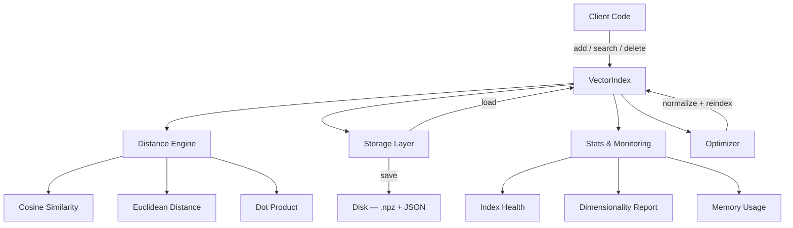

# IndexPulse

[](https://github.com/officethree/IndexPulse/actions/workflows/ci.yml)
[](https://www.python.org/downloads/)
[](LICENSE)
[](https://github.com/psf/black)

**Real-time vector index manager** — a lightweight, in-memory Python library for managing, monitoring, and optimizing vector indexes for similarity search.

Inspired by vector DB trends ([Milvus](https://milvus.io/), [Qdrant](https://qdrant.tech/), [Chroma](https://www.trychroma.com/)), IndexPulse strips away the server overhead and gives you a pure-Python index you can embed anywhere.

---

## Architecture



## Features

- **Multiple distance metrics** — cosine similarity, euclidean distance, dot product
- **Metadata filtering** — attach arbitrary JSON metadata to every vector
- **Persistence** — save/load indexes to disk (numpy `.npz` + JSON sidecar)
- **Index stats & monitoring** — vector count, dimensionality, memory estimates
- **Optimization** — normalize vectors, compact storage
- **Zero infrastructure** — no server, no containers, just `pip install`

## Quickstart

```bash
pip install indexpulse
```

```python
import numpy as np
from indexpulse import VectorIndex

# Create an index
index = VectorIndex(dimension=128)

# Add vectors with metadata
for i in range(1000):
    vec = np.random.randn(128).astype(np.float32)
    index.add(id=f"doc-{i}", vector=vec, metadata={"source": "wiki", "page": i})

# Search
query = np.random.randn(128).astype(np.float32)
results = index.search(query, k=5, metric="cosine")

for result in results:
    print(f"{result.id}  score={result.score:.4f}  meta={result.metadata}")

# Persist to disk
index.save("my_index")

# Reload later
index2 = VectorIndex.load("my_index")

# Monitor health
print(index.get_stats())
```

## Configuration

```python
from indexpulse import VectorIndex, IndexConfig

config = IndexConfig(
    dimension=256,
    default_metric="cosine",
    normalize_on_add=True,
    max_vectors=100_000,
)

index = VectorIndex.from_config(config)
```

## Development

```bash
git clone https://github.com/officethree/IndexPulse.git
cd IndexPulse
make install    # editable install + dev deps
make test       # run pytest
make lint       # ruff + black --check
```

## License

MIT — see [LICENSE](LICENSE) for details.

---

Built by **Officethree Technologies** | Made with ❤️ and AI
